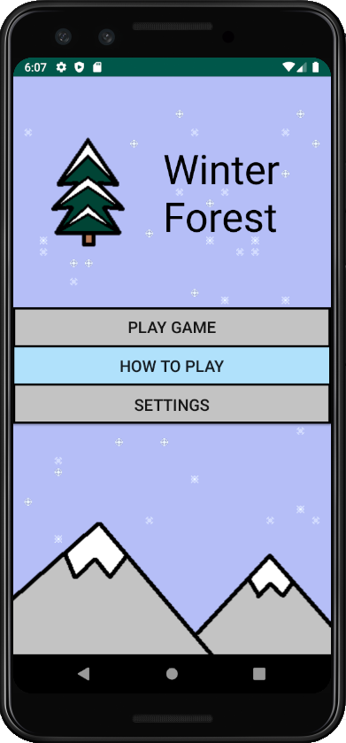
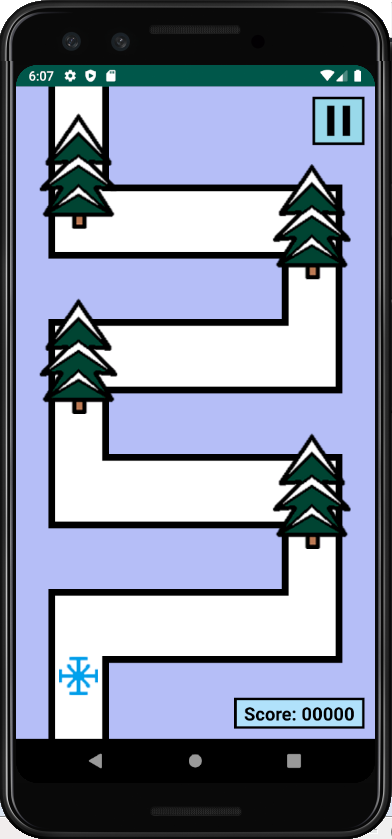

# Winter Forest
This is an app created using Android's Canvas. A snowflake attempts to move through a path which is obstructed by objects such as trees and stones. The player earns points by dragging the objects to another part of the path to allow snowflakes through, but must be sure to not impede other moving snowflakes in the process.

Includes animations, drag-and-drop, collision detection, sound effects, Shared Preferences.

 

Released under the public domain.